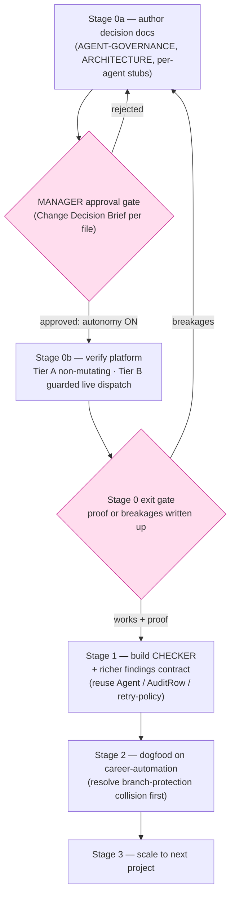

# Mature the ai-sdlc platform

> **Reframe:** Phase A (shipped 2026-05-26) already implements the role-agent/gating/orchestrator core.
> This is **extend, not design**: verify the platform, build the missing judgment-gate piece (CHECKER),
> then dogfood on career-automation, then scale.

## North-star goal
Ship **N PRs/day** through this pipeline; throughput is the success metric, raised each iteration.
Every choice is judged: *does it raise throughput without losing MANAGER control?*

## Context (why this exists)
Phase A already implements the role-agent/gating/orchestrator core: typed `Agent<TPayload,TOutput>`,
BUILDER/TESTER/REVIEWER/PLANNER/REPORTER, an orchestrator retry loop, hash-chained `AuditRow` with a
deterministic `validations` matrix, `DefinitionOfDone` + Tier 0–4 + HITL gates, multi-tenant
`ProjectConfig`/`ProjectState`, a `pnpm sdlc` CLI, and a GitHub-board state machine. The learnings review
showed career-automation's "must-haves" were advisory prose; the real fix is the enforcement *machine*,
which mostly exists in ai-sdlc — so we **verify it, build the missing CHECKER, then dogfood.**

## Strategy (locked)
- **Stage 0a — Author the decision docs** (MANAGER's decision artifact). Autonomy is granted only AFTER these are approved.
- **Stage 0b — Verify the platform runs** end-to-end (do the docs match reality?).
- **Stage 1 — Build the genuine gap:** the L2 CHECKER (audit-the-agent's-own-work + selective-feedback refire) + richer `findings` contract. Specialized reviewer fleet + AGGREGATOR **deferred** until data justifies.
- **Stage 2 — Onboard career-automation** as the polishing testbed; harden setup + workflows on the most mature repo.
- **Stage 3 — Scale** to another parallel project with learnings baked into the platform.

**Autonomy switch:** once Stage-0a docs are MANAGER-approved, Stages 0b→3 run **autonomously within the
guardrails below**, escalating to MANAGER only at calibrated (blast-radius) gates.

---

## Stage 0a — Author the decision docs (the MANAGER decision artifact)
Authored in ai-sdlc, presented for review **before** autonomy is granted. Each proposed file is presented
as one **Change Decision Brief** (format below) so MANAGER decides per the requested format.

1. **`AGENT-GOVERNANCE.md`** — the MECE governance model (G/E/X/O/H/R, below) + enforcement legend + roster + MANAGER role + autonomy/tier model. Every agent spec maps to it.
2. **`SDLC-ARCHITECTURE.md`** (or update existing `ARCHITECTURE.md`) — pipeline flow, single-vs-multi rationale, CHECKER design, N-PRs/day goal, autonomy switch.
3. **Per-agent spec stubs** — one per role: scope, tools (least-privilege), MUST/GOOD/OPTIONAL tiers, DoR/DoD, audit fields.

### Change Decision Brief — the format MANAGER reviews EVERY gated change in
- **Location** — file / module / path.
- **Change** — what changes, concretely.
- **Impact** — +ve / −ve effects.
- **Blast radius** — Tier 0–4 + what it can break.
- **Pros / Cons / Gotchas** — incl. potential false-positives + rollback path.

---

## Stage 0b — Platform verification (executable)
See the companion runbook `verification-2026-05-31-runbook.md` for the exact commands. Summary:

- **Tier A — non-mutating (run first, no go needed):** orient/confirm-the-map → `pnpm install` +
  typecheck/lint/test green → read-only CLI (`pnpm sdlc --help|status --json|board`) → read the dispatch
  path to enumerate live-run requirements. Exit: green + read-only CLI works, **or** a concrete breakage list.
- **Tier B — guarded live dispatch (needs explicit MANAGER go + sacrificial task):** define a trivial
  Tier-0/1 throwaway task in the Ready column → `pnpm sdlc dispatch` once → observe BUILD→TEST→REVIEW +
  a written `AuditRow` (validated with `jq`) + the board column move → reset the throwaway scope.

**Stage 0 exit gate** — write `verification-2026-05-31.md` ending in exactly one of:
- ✅ **"Phase A works"** — paste the test summary, CLI output, and one real `AuditRow` + board move → unlock Stage 1.
- ❌ **"Concrete breakages"** — itemized (command, expected, actual, exit code) → loop back; Stage 1 does not start until resolved or MANAGER-waived.

---

## Agent governance rules (acceptance criteria for Stage 1)

**Agent roster** (user's names → ai-sdlc roles): ORCHESTRATOR (exists) · PLANNER/BUILDER/TESTER/
REVIEWER/REPORTER (exist, v1) · **CHECKER** (NEW — independent handoff-validator / L2 meta-checker;
≈ AGGREGATOR-plus) · SECURITY-REVIEWER + specialized fleet (roles in enum, agents unbuilt).

Structured MECE by **agent lifecycle phase** (each rule has one home; collectively exhaustive:
entry→execution→exit→gate→recurring + always-on invariants). Each rule names its **enforcement
mechanism**. `‹›` tags trace to the origin discussion (U# = user, A# = assistant).

**Enforcement legend:** **[D]** deterministic machine-check, blocks at boundary · **[S]** schema
validation, blocks at boundary · **[C]** CHECKER independent semantic audit (pass or pointed-feedback
refire) · **[H]** human/HITL gate · **[R]** recurring audited duty.

### G — Cross-cutting invariants (every agent, always; platform defines once)
- **G1 [S]** Each agent has an explicit spec: priority/severity-tagged expectations, **bounded scope**, capabilities, **minimum** toolset (least-privilege); REVIEWER/CHECKER read-only by default. ‹U1,U7,A8›
- **G2 [H]** External/irreversible actions (push/send/submit) are approval-gated; no agent does them unilaterally. ‹A8›
- **G3 [S]** All agent I/O conforms to a **versioned contract**; severity uses the **single shared P0–P3 rubric**. ‹A4,A10›
- **G4 [R]** Every run is auditable across **Inputs · Within-agent Processing · Outputs**, recording commit SHA, config + prompt version, model, tokens/cost/time. ‹U3,A12›
- **G5 [D]** Per-agent token/cost/time **budget**; overrun is a logged escalation. ‹A9›

### E — Entry (Definition-of-Ready)
- **E1 [S/D]** Validate inputs are sufficient **and** schema-valid before working; else return `NEEDS-INFO`, do not proceed. ‹A1,A10›

### X — Execution (within-agent processing)
- **X1 [C]** No fabrication: echo tool output verbatim; never invent IDs/paths/metrics; surface assumptions **as** assumptions. ‹A7›
- **X2 [D]** Test/validate own work to substantiate every claim it will make. ‹U6›
- **X3 [R]** Update affected repo docs + task/project context as part of the work (not after). ‹U6›

### O — Exit (self-review + output assembly, before handoff)
- **O1 [C]** Diligent self-review before handoff — hygiene gate: necessary, never sufficient. ‹U6,A2›
- **O2 [S]** Output tiered against the agent's checklist: **MUST** (zero misses) · **GOOD** (explicitly verified apply/not) · **OPTIONAL** (concluded); includes a **false-positive sweep** for items mis-tagged OPTIONAL that are really MUST/GOOD, and flags release-blockers + key fixes. ‹U4›
- **O3 [D]** Every output claim is backed by a **resolvable** artifact/validation with provenance (`file:line`, command+exit-code, requirement/task ID). ‹U2,A6›
- **O4 [S]** Judgmental findings carry a **confidence**; low-confidence is flagged for the CHECKER. ‹A11›
- **O5 [S]** Handoff carries an explicit outcome: `SUCCESS | SUCCESS-WITH-CAVEATS | BLOCKED | FAILED` — never silent partial. ‹A5›

### H — Handoff & gating (CHECKER — independent, no stake; producer ≠ signer)
- **H1 [D]** Re-verify all deterministic claims (build/lint/test/coverage) by **re-running** them; an agent's word is never the gate for machine-checkable facts. ‹A3›
- **H2 [C]** Independently audit Inputs·Processing·Outputs against all gates/guardrails/principles. ‹U5,A2›
- **H3 [C]** Pass forward, **or** return pointed, actionable feedback for rework. ‹U5›
- **H4 [C]** Arbitrate inter-agent conflicts (e.g., REVIEWER vs SECURITY-REVIEWER) by **written policy**. ‹A13›
- **H5 [D/H]** Bounded, observable iteration: loop ≤N; each iteration logs {feedback-in, what-changed}; non-convergence escalates to HITL with full history. ‹A5›

### R — Recurring (cadence, audited)
- **R1 [R]** Continuation-doc upkeep is a followed-through duty at every trigger (also feeds future blog content mined from continuation docs). ‹U6›
- **R2 [R]** Per-agent learnings-review at a cadence → learnings log → **fed back into the agent's versioned prompt cohort**. ‹U6,A14›

**MECE check:** every U1–U7 / A1–A14 lands in exactly one item. **Stage-1 "done" =** the CHECKER + each
agent spec encodes every applicable G/E/X/O/H/R item, and each item's enforcement mechanism is wired
([D]/[S] machine-checked, [C] CHECKER-audited, [H] gated, [R] scheduled). This governance model becomes
ai-sdlc `AGENT-GOVERNANCE.md`; every agent spec maps to it.

## Roles, autonomy & control

### MANAGER (the user) — final authority
**MANAGER = Piyush**, atop the roster. Agents propose; **MANAGER disposes at gates**.

### Single vs. multi agent (locked — optimized for N PRs/day)
- **Keep the 5 core roles separate now** — distinct cognitive modes + required for separation-of-duties (A2/H2). Not overkill.
- **CHECKER separate** — independence is the point. Justified.
- **DEFER the specialized reviewer fleet** (SECURITY/CODE-QUALITY/BUG/DESIGN/PERF as distinct agents) — overkill now; 6× dispatch/cost/latency hurts throughput for no proven benefit. Use one **generalist REVIEWER** (runs a security pass when blast-radius warrants); split **SECURITY out first**, only when the generalist misses a class **3×** (ai-sdlc's own graduation trigger).
- **Also off now:** all 5 HITL gates (keep G2 + MANAGER gates); L2 refiring on nitpicks (reserve for substantive gaps; cap iterations).

### Autonomy ↔ control reconciliation (calibrated by blast radius / Tier)
- **Low blast-radius (Tier 2–3 routine)** → ships autonomously through the gated pipeline; no MANAGER touch.
- **High blast-radius (Tier 0–1; auth/schema/secrets/external-surface/irreversible)** → escalates to MANAGER HITL with a Change Decision Brief.
- **HARD RULE — CLAUDE.md changes (ANY repo) ALWAYS require explicit MANAGER approval** — never autonomous, regardless of tier.

---

## Stage 1 — Build the gap (smallest buildable slice)

Detailed design lands **after** Stage 0 (it needs the live code), but the slice and the reused primitives
are fixed now so it's buildable, not just sketched. **Reuse, do not reinvent:** `Agent<TPayload,TOutput>`
interface, `AuditRow`, `Task`/`DefinitionOfDone`/`Tier`, HITL types, the orchestrator retry-policy.

### Slice 1 (ship first) — CHECKER + selective-feedback refire
The novel piece. A read-only meta-checker that audits whether an agent's **output quality** meets the bar
(e.g., did TESTER's matrix cover the sad/edge paths implied by the diff?), emits structured
`deficiencies[]`, and the orchestrator refires **only the owning agent** with **only those deficiencies**.
This extends the existing *outcome-based* retry loop with a *quality-based* refire — it does not replace it.

Concrete build, smallest viable:
1. **New role + agent:** add `CHECKER` to the existing `AgentRole` enum; implement `agents/checker/index.ts`
   against the `Agent` interface (read-only toolset per G1). Prompt at `prompts/checker/v1.md`.
2. **`CheckerOutput` schema** (versioned per G3): `{ verdict: PASS | REFIRE | ESCALATE, deficiencies: Deficiency[], confidence }`.
   `Deficiency = { owner_role, severity (shared P0–P3), what, why_it_matters, evidence_ref, suggested_fix }`.
   Deterministic facts (build/lint/test) are **re-run** (H1), not trusted from the producer's word.
3. **Orchestrator wiring:** after a producer's handoff, dispatch CHECKER; on `REFIRE`, re-dispatch the
   owning agent with the `deficiencies[]` as the sole new input. **Bounded loop (H5):** `≤N` iterations,
   each logging `{feedback-in, what-changed}` to the `AuditRow`; non-convergence → HITL escalation with
   full history. Reuse the existing retry-policy counter/structure rather than adding a parallel loop.
4. **Audit:** CHECKER runs are normal `AuditRow`s (G4) — Inputs·Processing·Outputs, model, tokens/cost/time.

### Slice 2 (same stage, after Slice 1 lands) — richer `findings` contract
Extend `ReviewerOutput.findings` to the detailed schema (versioned, P0–P3): `severity, criticality,
module/file, status, owner/assignee, ETA, 2-liner, repro/evidence_ref, created_at/by`. Aligns
REVIEWER output with `Deficiency` so the CHECKER consumes both uniformly.

### Explicitly DEFERRED (do not build in Stage 1)
- **Specialized reviewer fleet** (SECURITY/CODE-QUALITY/BUG/DESIGN/PERF as distinct agents) — graduate per the 3×-miss trigger; SECURITY first.
- **AGGREGATOR** (multi-reviewer verdict merge + false-positive drop) — only needed once >1 reviewer exists.

**Stage-1 done =** CHECKER + the two slices shipped, every applicable G/E/X/O/H/R item encoded with its
enforcement mechanism wired, full test green, and one real run showing a CHECKER `REFIRE` → bounded
refire → converge in the audit log.

## Stage 2 — Polish on career-automation
Onboard via `pnpm sdlc onboard`. **Resolve the onboarding prerequisite collision first:** `ONBOARDING.md`
requires **branch protection on main**, which career-automation can't enable (private + free plan → 403).
Pick one: GitHub Pro · make-public (after a secrets/git-crypt audit) · relax the onboarding check for
private-free repos. Then run real tasks through the matured pipeline; fix what breaks. This is where the
career-automation CLAUDE.md gets (re)written by the platform as a **binding** contract — superseding the
deferred Appendix-A doc work. (CLAUDE.md rewrite is the HARD-RULE gate → MANAGER approval.)

## Stage 3 — Scale
Onboard another project with the polished platform; perfect across remaining testbeds per ai-sdlc's
ROADMAP (trip-research, piyush-portfolio, ai-finance-tracker, ai-health-agent).

---

## Verification (Stage 0 is the gate for the whole effort)
- **Tier A:** lint/typecheck/test green output + successful read-only CLI calls (paste output into `verification-2026-05-31.md`).
- **Tier B:** one real audit row (`.audit/<date>/runs/*.jsonl`, validated with `jq`) from a live dispatch + the board column move.
- **Stage 1:** full test green + one audit-logged CHECKER `REFIRE`→converge cycle.

## Post-exit housekeeping
- Write continuation entries: ai-sdlc `CONTINUATION.md` (this becomes the active workstream) + a note in career-automation `tasks/continuation.md` that learnings-review Phase 2 is superseded/deferred.
- The Phase-1 mechanical learnings fixes already applied (global CLAUDE.md + memory) stay as-is.

## Appendix A — DEFERRED: original Phase-2 career-automation doc overhaul
Preserved for reference; not to be committed (treats symptom, not root cause). The role-mapped SDLC.md
content + C1 dedup / I4 hard-stops-index / I5 git-stash / I6 MEMORY-pointer / I1 session-start / S2
PR-lifecycle edits remain useful raw material for Stage 2's binding CLAUDE.md, written by the matured
platform. Full text: prior plan version + `career-automation/tasks/session-2026-05-30-learnings-review.md`.
